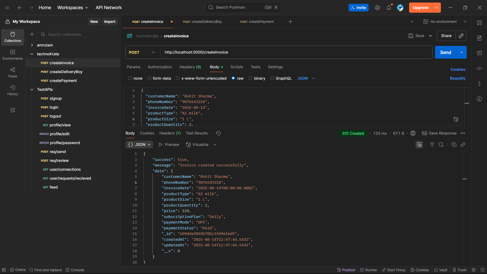
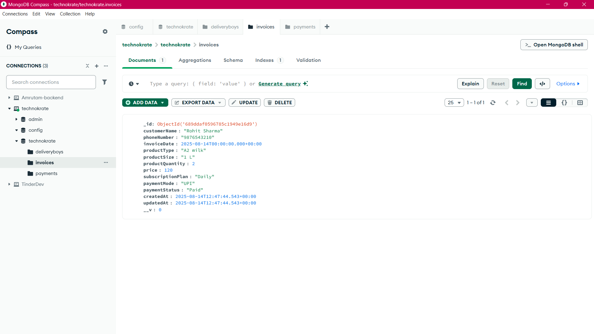
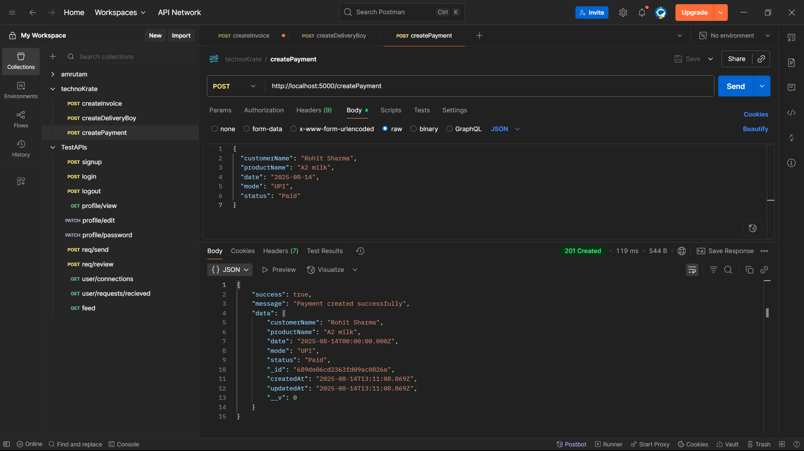
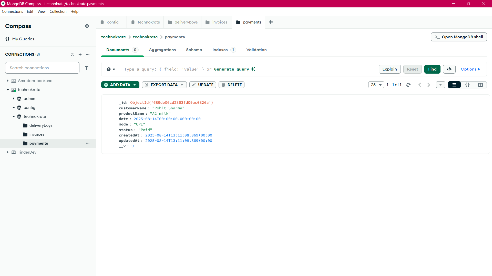
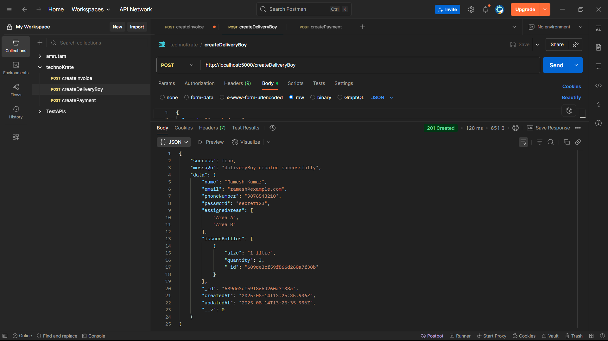
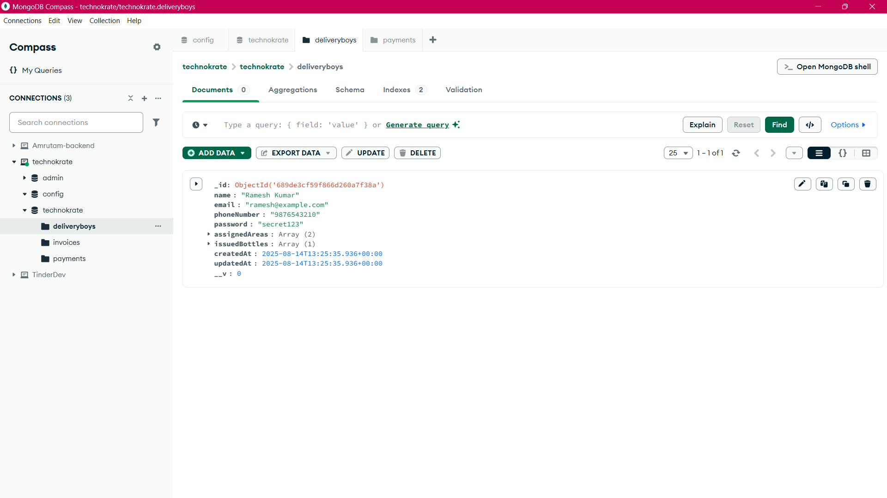

# API Testing (Postman)

## Create Invoice

Tested invoice creation with valid customer, date, and product details.  
  
**Database After Invoice Creation:**  

## Create Payment

Tested payment recording for a customer.  
  
**Database After Payment Recording:**  

## Create Delivery Boy

Tested adding a delivery boy with assigned areas and issued bottles.  
  
**Database After Adding Delivery Boy:**  

## Project Structure

- **app/**

  - **controllers/** – Logic for handling requests and responses (e.g., `paymentController.js`).
  - **models/** – Mongoose models for database collections (`DeliveryBoy.js`, `Invoice.js`, `Payment.js`).
  - **routes/** – API endpoints mapped to controllers (`deliveryBoyRoute.js`, `invoiceRoute.js`, `paymentRoute.js`).
  - **utils/** – Utility functions for validation (`validateDeliveryBoy.js`, `validateInvoice.js`, `validatePayment.js`).

- **.env** – Environment variables configuration.
- **server.js** – Entry point; starts the server and connects routes.
- **package.json** – Project dependencies and scripts.
- **.gitignore** – Files/folders ignored by Git.
- **createtest.png** – API testing screenshots.
- **ReadMe.md** – Project documentation.
